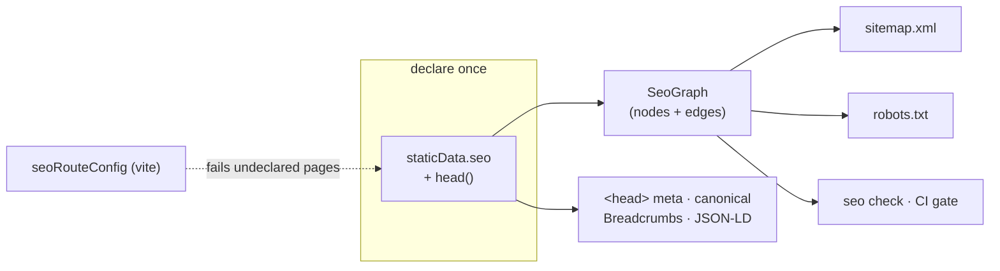

# tanstack-plugin-seo

Route-declared SEO for TanStack Router. Each route declares its SEO policy once, in
`staticData.seo` — the sitemap, `robots.txt`, breadcrumbs, JSON-LD, cross-links, and
the CI check all derive from that one declaration. There is no second place to update,
so nothing drifts. A public page that ships without a declaration **fails the build**.



## Install

```bash
bun add tanstack-plugin-seo
bun add -D effect @effect/platform-bun   # only if you use the CLI
```

| Entry | Exports | Peers |
| --- | --- | --- |
| `tanstack-plugin-seo` | `buildSeoGraph`, `renderSitemap`, `renderRobots`, `checkGraph`, `inspectHtml` | — |
| `tanstack-plugin-seo/react` | `createSeo` → `seoHead`, `Breadcrumbs`, JSON-LD generators | `react`, `@tanstack/react-router` |
| `tanstack-plugin-seo/vite` | `seoRouteConfig` coverage gate | `vite` |
| `tanstack-plugin-seo/config` | `defineSeoConfig`, `viteGraphLoader` | `vite` |
| `seo` bin | CLI over the same graph | `effect`, `@effect/platform-bun` (optional) |

The core and React entries have **zero runtime dependencies** — everything above is a
peer, and only the entries you import need theirs installed.

## Quick start

**1. Bind your site identity once.** Route files never see an origin or a brand name.

```ts
// lib/seo.ts
import { createSeo } from "tanstack-plugin-seo/react";

export const { seoHead } = createSeo({
  origin: "https://example.com",
  site: {
    name: "Example",
    logo: "/logo.png",
    publisherLogo: "/publisher.png",
    defaultImage: "/og.png",
    defaultAuthor: { name: "Example Team" },
  },
  organization: {
    description: "What the company does.",
    sameAs: ["https://github.com/example"],
    contactPoint: { contactType: "support", email: "hi@example.com" },
  },
  website: { searchPath: "/docs?q={search_term_string}" },
});
```

**2. Declare on the route.** Policy in `staticData.seo`, per-page content in `head()`.

```tsx
export const Route = createFileRoute("/pricing")({
  staticData: {
    seo: {
      kind: "page",
      crumb: "Pricing",
      sitemap: { priority: 0.9, changeFrequency: "weekly" },
      related: ["/features", "/docs"],
      link: { title: "Pricing", description: "Simple volume pricing." },
    },
  },
  head: (ctx) => seoHead(ctx, {
    title: "Pricing — Example",
    description: "Simple volume pricing.",
  }),
});
```

`seoHead` returns the `meta` + canonical `links` TanStack renders into `<head>` —
title, description, og/twitter cards, robots, and the JSON-LD each page warrants
(BreadcrumbList always; Article, FAQPage, Service, ItemList when the instance
declares them).

**3. Serve the projections.** Build the graph from your route tree, render strings.

```ts
// lib/seo/graph.ts — also the module the CLI loads
import { buildSeoGraph } from "tanstack-plugin-seo";

export const loadSeoGraph = () =>
  buildSeoGraph({ routeTree, collections: [blogCollection] });
```

```ts
// routes/sitemap[.]xml.ts — robots[.]txt.ts is symmetric
import { renderSitemap } from "tanstack-plugin-seo";

renderSitemap(loadSeoGraph(), { origin, indexable: true });
```

**4. Gate CI.** The same graph, the same rules, exit 1 on structural violations.

```bash
seo check
```

## Typed paths

Augment `Register` (the same pattern TanStack Router uses) and `related` /
`redirectTo` are typed against your real route tree — a renamed route becomes a
compile error, not a dead link:

```ts
declare module "tanstack-plugin-seo" {
  interface Register {
    paths: FileRouteTypes["fullPaths"];
    kinds: "page" | "article" | "hub";
  }
}
```

## The graph

`buildSeoGraph` walks the route tree and produces nodes (one per public URL) and
typed edges: `crumb-parent` (breadcrumb ancestry), `related` (deliberate
cross-links), `redirect`, and `collection-member`.

Dynamic pages — blog posts rendering through `/blog/$slug` — enter as
**collections**. Instances inherit the param route's declared policy, so
declarations stay the single source of truth:

```ts
const blogCollection: SeoCollection = {
  route: "/blog/$slug",
  source: "blog",
  instances: posts.map((p) => ({
    path: `/blog/${p.slug}`,
    title: p.title,
    description: p.description,
    publishedAt: p.date,
  })),
};
```

`checkGraph` runs every rule against the graph and returns violations at two
severities:

- **structural** — internally broken declarations; these fail `seo check` (exit 1):
  dead or duplicate edges, path collisions, a redirect in the sitemap, a
  sitemap/noindex contradiction, a `related` target with no `link` card, an
  instance without a title.
- **editorial** — quality smells, reported but non-failing: duplicate or mis-sized
  titles and descriptions.

## Coverage gate (Vite)

`seoRouteConfig` parses the route tree with `@tanstack/router-generator` (the same
parser as the router) and fails `vite build` when a page in an enforced group has
neither `staticData` nor `head`:

```ts
// vite.config.ts
import { seoRouteConfig } from "tanstack-plugin-seo/vite";

seoRouteConfig({
  outputPath: fileURLToPath(new URL("./lib/route-config.ts", import.meta.url)),
  publicGroups: ["(marketing)", "(docs)"],
  enforceCoverageIn: ["(marketing)", "(docs)"],
  alwaysDisallow: ["/dashboard", "/api"],
});
```

It also derives a small config module from the route tree: `robotsExclusions`
(feed to `renderRobots`) and `reservedSegments` (top-level segments an app must
not hand out as tenant/org slugs).

## CLI

The CLI acquires your graph through `seo.config.ts` at the app root — the
`viteGraphLoader` evaluates your graph module inside a headless Vite server, so
path aliases, content plugins, and virtual modules all resolve:

```ts
// seo.config.ts
import { defineSeoConfig, viteGraphLoader } from "tanstack-plugin-seo/config";

export default defineSeoConfig({
  origin: "https://example.com",
  disallow: routeConfig.robotsExclusions,
  loadGraph: viteGraphLoader({
    root: import.meta.dirname,
    entry: "/lib/seo/graph.ts",
    exportName: "loadSeoGraph",
  }),
});
```

```bash
seo check                 # CI gate — exit 1 on structural violations
seo graph                 # the graph as a tree · --format mermaid | json
seo inspect /pricing      # one node: policy, sitemap status, in/out edges
seo inspect <url> --live  # fetch a deployed page, validate its rendered <head>
seo sitemap               # print sitemap.xml
seo robots                # print robots.txt
```

Stdout is data, stderr is status — `seo check --json | jq` just works.

## Testing

Everything the CLI checks is a pure function you can call from a test:

```ts
import { checkGraph, hasStructuralViolations, inspectHtml } from "tanstack-plugin-seo";

expect(hasStructuralViolations(checkGraph(loadSeoGraph()))).toBe(false);

// render a page however you like, then assert the head it actually ships
const report = inspectHtml(url, 200, html);
expect(report.issues).toEqual([]);
```

## License

MIT
